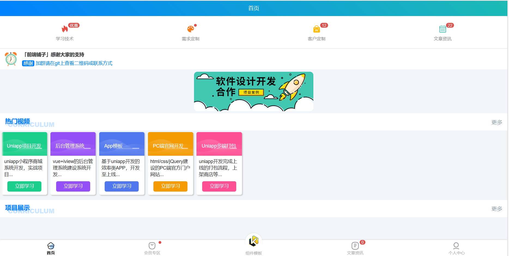
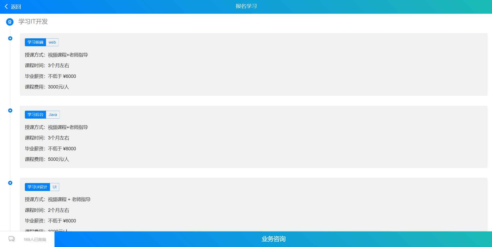
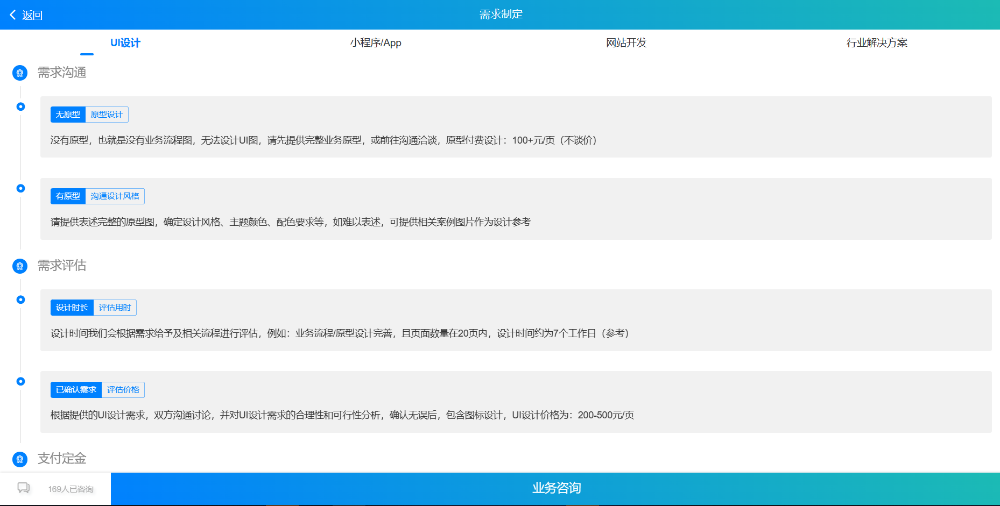
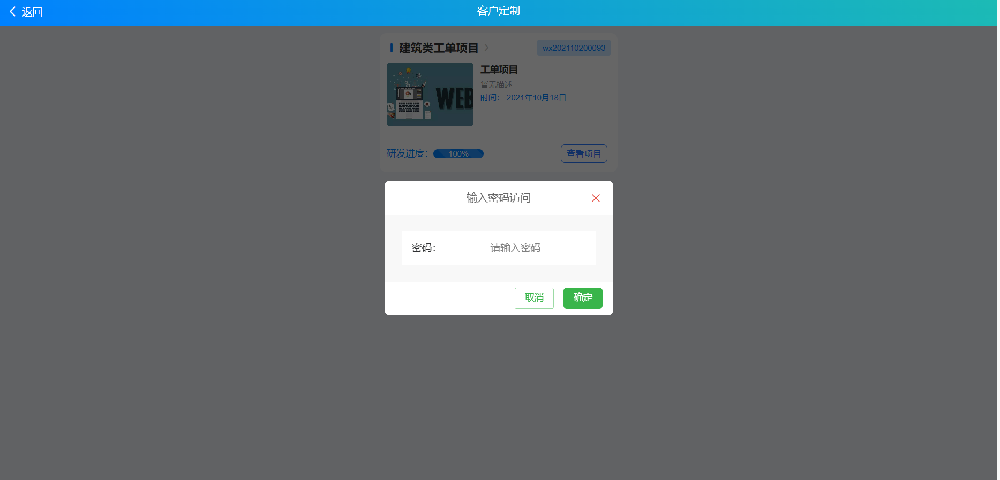
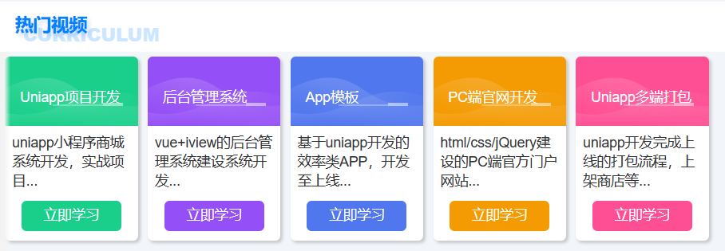
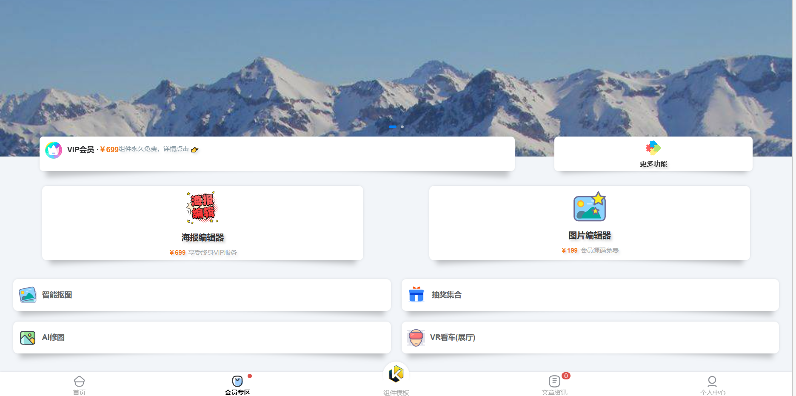

# 前端铺子APP项目

## 项目简介
前端铺子APP是一个集学习、定制需求、项目管理和知识分享于一体的综合性平台。

## 使用说明
1. **安装与运行**：使用HBuilderX编辑器将文件下载并导入，找到main.js文件运行即可，部署到本地的浏览器。

## 功能模块
### 5.1 登录界面
用户输入账号和密码，验证通过后即可登录系统。

### 5.2 首页界面
登录成功后，用户将进入APP首页。

### 5.3 学习技术界面
用户可以通过首页导航栏进入学习技术界面。

### 5.4 需求定制界面
用户点击导航栏的第二个选项即可进入需求定制界面。

### 5.5 客户定制界面
用户通过导航栏进入客户定制界面，可以查看工单项目。

### 5.6 热门视频界面
首页中间的热门视频板块提供了一系列前端核心知识讲解视频。

### 5.7 会员专区界面
用户点击首页底部的会员专区按钮，即可进入会员专区界面。

